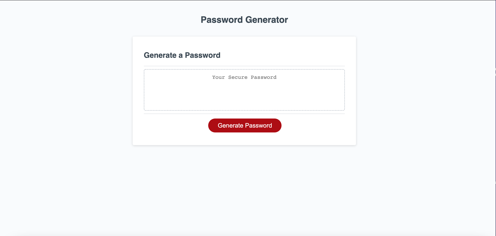

# Challenge 03

## Description
- This challenge was to create a Javascript function that generated a random password based on user selected criteria consisting of a length of numbers, lowercase alphabet, uppercase alphabet, and special characters. 

### Website

### Link
[Password Generator](https://ahuang23.github.io/C03_Password_Generator/)